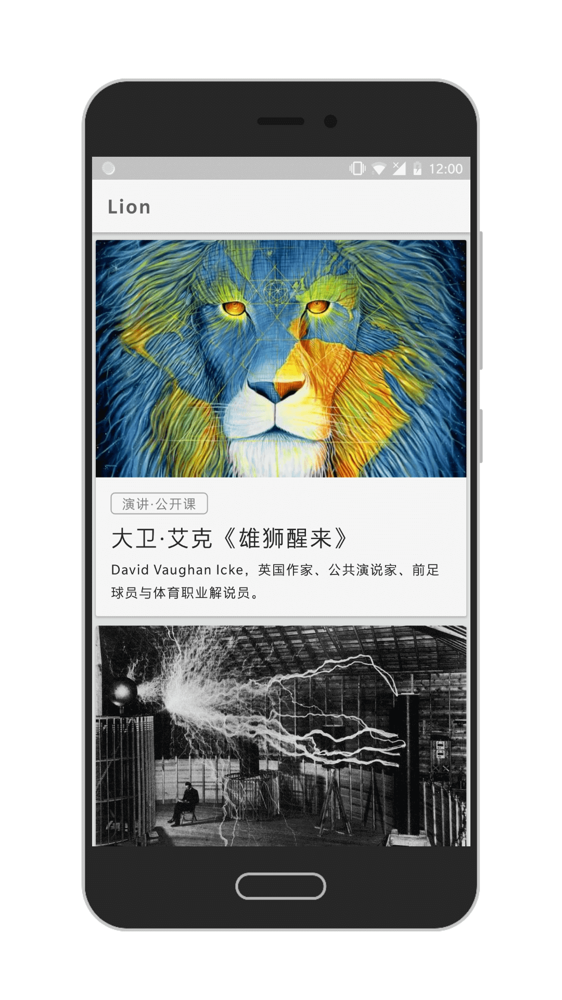
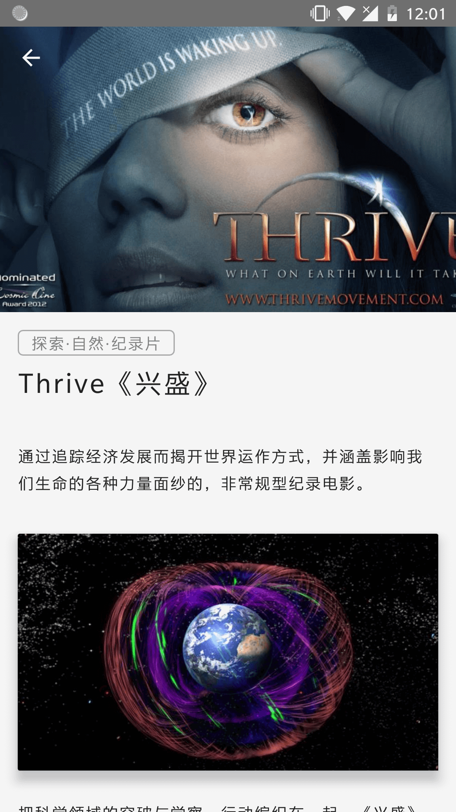
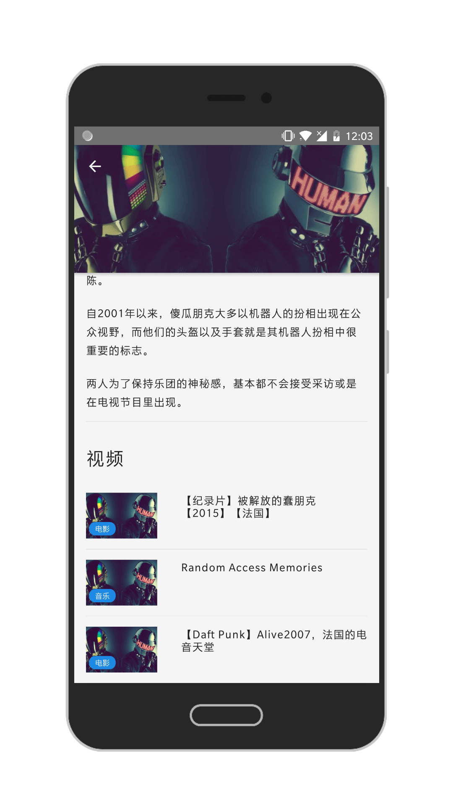
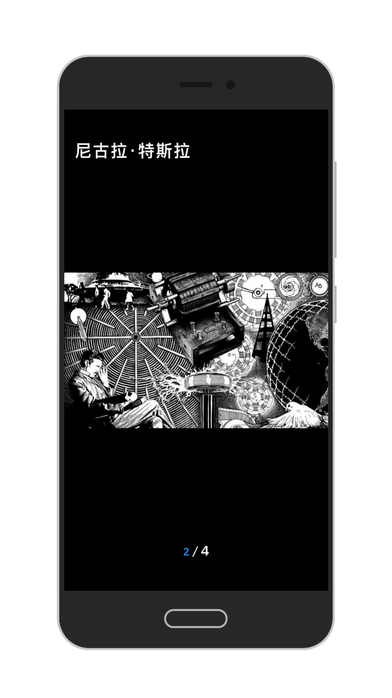
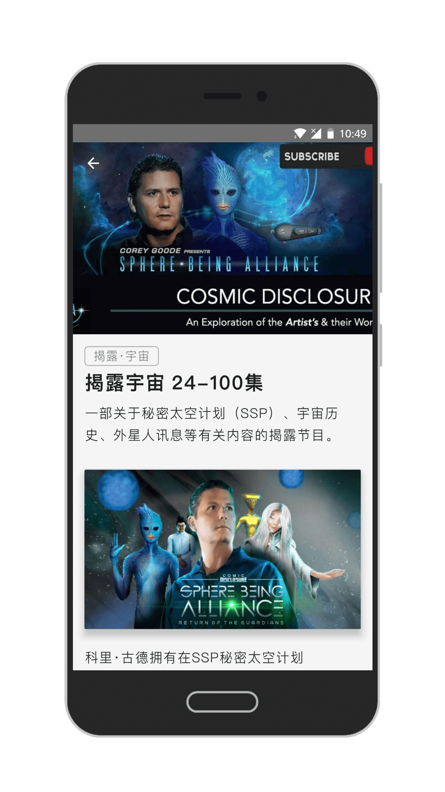
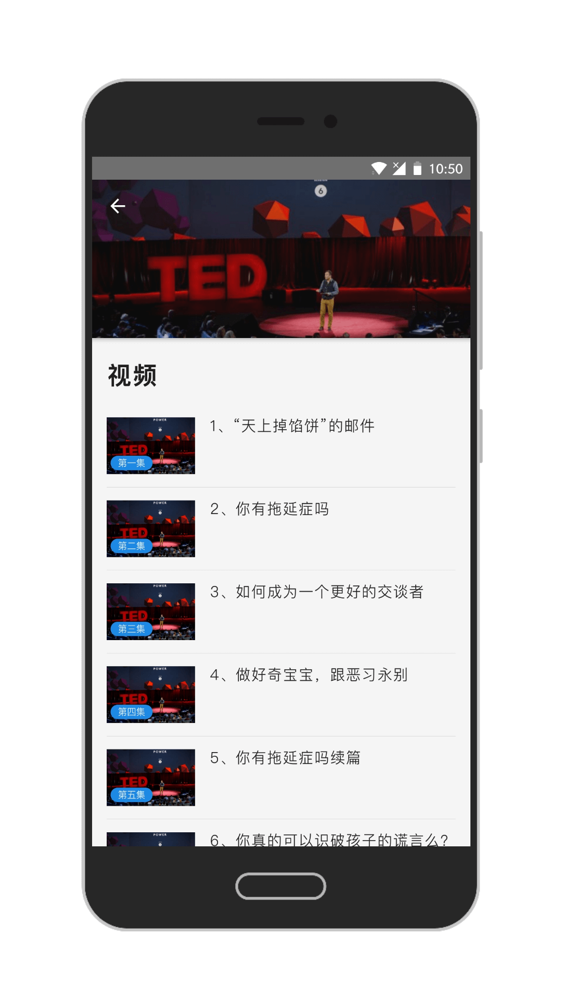

Lion
===============

movie app for android

Screenshots
===============

 
 

 

Download :tada:
------

[coolapk - (Lion app download)](https://www.coolapk.com/apk/198282)

[fir - (Lion app download)](https://fir.im/lion333)

Developed by:
-------

 ruzhan - <a href='javascript:'>dev19921116@gmail.com</a>

License
-------

    Copyright 2018 ruzhan

    Licensed under the Apache License, Version 2.0 (the "License");
    you may not use this file except in compliance with the License.
    You may obtain a copy of the License at
    
        http://www.apache.org/licenses/LICENSE-2.0
    
    Unless required by applicable law or agreed to in writing, software
    distributed under the License is distributed on an "AS IS" BASIS,
    WITHOUT WARRANTIES OR CONDITIONS OF ANY KIND, either express or implied.
    See the License for the specific language governing permissions and
    limitations under the License.

